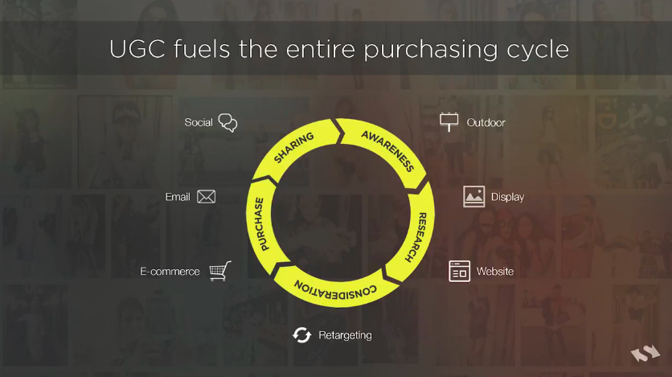
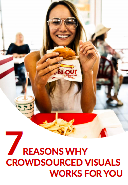

# @demimonde/research

`@demimonde/research` is an overview of the current players in the market.

## Table Of Contents

- [Table Of Contents](#table-of-contents)
- [A/B Testing](#ab-testing)
  * [Meta-Lists](#meta-lists)
  * [Companies](#companies)
- [UGC](#ugc)
  * [Customer-Centric](#customer-centric)
  * [Curation and Moderation](#curation-and-moderation)
  * [Visual Recognition](#visual-recognition)
  * [Targeting](#targeting)
  * [Events](#events)
  * [Blogs](#blogs)
  * [Companies](#companies)
- [Photo Selling](#photo-selling)
  * [Apps](#apps)
- [Domains](#domains)
  * [demimonde](#demimonde)
  * [demi](#demi)
  * [monde](#monde)
  * [demee](#demee)
  * [demy](#demy)
  * [demie](#demie)
  * [deme](#deme)
  * [demmy](#demmy)
  * [demmie](#demmie)
  * [dem](#dem)
  * [mondaine](#mondaine)
- [Videos](#videos)
- [PDFs](#pdfs)
  * [$3](#3)
- [Videos](#videos)
  * [$2](#2)
- [TODO](#todo)
- [Copyright](#copyright)

## A/B Testing

A/B testing allows to introduce a change to the website, and understand what impact it is going to have, measured in terms of increased or decreased conversion rate or the rate of reaching a certain touchpoint in the user journey. To be able to tell with certainty that the impact was due to that change, a statistical significance measure is used, which requires quite a lot of data.

### Meta-Lists

[A/B Testing: What are the alternatives to Optimizely?](https://www.quora.com/A-B-Testing-What-are-the-alternatives-to-Optimizely)

### Companies


|                             Company                             |                                                                                               Tag Line                                                                                               | Evaluation |
| --------------------------------------------------------------- | ---------------------------------------------------------------------------------------------------------------------------------------------------------------------------------------------------- | ---------- |
| <a href="https://vwo.com"></a> | **A/B Testing and Conversion Optimization Platform™**<br/>VWO is the all-in-one platform that helps you conduct visitor research, build an optimization roadmap, and run continuous experimentation. | $10m       |

## UGC

The UGC (user-generated content) systems are those that allow businesses to use people's content in their marketing campaigns. The content comes from social media websites such as Instagram, Twitter and Facebook, and can be discovered with hashtags and keywords. When a relevant image is found, the system would ask the creator for their consent to use the image. Once the consent is obtained, the image is recorded in the database, and can be used in advertising materials across different media, including offline such as digital displays and billboards, as well as online on the company's website, social media and in retargeting ads.

### Customer-Centric

The strategy of using UGC is such that to place the customer in the center of a campaign, instead of the brand. It gives people the sense of freedom since they can identify better with other individuals rather than a corporate entity. There are a number of particular market areas which benefit the most from using the UGC:

1. Travel: since pictures taken during travelling are generally the most inspiring and good-looking once because they convey an experience of new places and show the most interesting parts of cities, travel agencies can use the content at different parts of user journeys.
1. Hospitality: similar to travel, the hospitality industry can use the content to showcase the actual experience that people receive. This would make potential customers trust the images more since they are done by people just like themselves, and not by a professional photographer with wide-angle lens to make rooms look larger and then edited in an image manipulation program.
1. Sports: sporting events will usually generate a lot of user content.

### Curation and Moderation

Each picture coming in a stream can be approved before it is visible to the audience.

### Visual Recognition

Using the most modern techniques in Computer Vision, businesses can identify what objects each picture is showing, what colors it has and what is its mood, including exciting (e.g., jumping off with a parachute), calm (a lake in the morning) or work-related (an office space), and others. This can then be bucketed into certain marketing campaigns.

### Targeting

After the recognition on the image was done, and some tagging of the user performed (e.g., according to what articles they read on the website), they can be shown specific images. If a person read about running, they will be shown a picture of running shoes, for example.

### Events

One of the business directions is to use content projected on the screens during live-events.

### Blogs

https://www.socialmediaexaminer.com/user-generated-content-legally-leverage-in-marketing/

    Good read and timely. Brands and businesses need to own their UGC and the days of implied consent (via #yes or iApprove responses) are quickly coming to an end as they don't provide the legal protections, model releases, etc necessary to remove any potential liability.

    Anheuser Busch was recently sued in federal court over incorrect UGC usage. The case wasn't brought by the content creator, the case was brought to federal court by the model drinking a bottle of Natural Light n the photo.

    I recently wrote a piece about this on our blog. It's time brands own their UGC. And the only way to do so legally is to pay for it and have model releases.
### Companies

A list of companies.

1.  https://www.shortstack.com/features/: The most efficient, flexible and creative way to build and optimize your marketing campaigns.
1.  https://foundontack.com/ Authentic customer content to power your marketing
1.  https://photoslurp.com *Boost your sales with social content.* Your customers are creating User Generated Content around your brand on social media every single day. Our Visual Marketing platform finds these great photos and videos showing off your products for you and turns them into shoppable social proof.


## Photo Selling

https://www.enlightapp.com/blog/6-ways-to-sell-your-mobile-photography-for-actual-money/

https://www.twenty20.com/sell

https://www.foap.com/

https://glymt.com/

https://www.markedshot.com/

https://www.stockimo.com/

http://clashot.com/ (https://depositphotos.com/clashot.html)

http://www.snapcape.com/

### Apps

-  [FOAP](https://fnd.io/#/gb/ios-universal-app/521142420-foap-sell-your-photos-by-foap-ab)
- [Snapwire](https://fnd.io/#/gb/iphone-app/725106358-snapwire-sell-your-photos-by-snapwire-med)
- [Twenty20](https://fnd.io/#/gb/iphone-app/577323200-twenty20-sell-your-photos-by-fast-labs-in)
- [AGORA Images](https://fnd.io/#/gb/ios-universal-app/1050488345-agora-images-sell-your-photos-by-agora-a)
- [Dreamstime](https://fnd.io/#/gb/ios-universal-app/787325247-dreamstime-sell-photos-by-dreamstime-inc)
- [Coinaphoto](https://fnd.io/#/gb/iphone-app/921356009-coinaphoto-sell-photos-by-coinaphoto-fz-l)
- [miPic](https://fnd.io/#/gb/iphone-app/740119533-mipic-by-mipic-ltd)
- [BYLINED](https://fnd.io/#/gb/iphone-app/1072531306-bylined-sell-your-photos-by-bylined-me-l)
- [Stockimo](https://fnd.io/#/gb/iphone-app/798766796-stockimo-by-alamy-limited)
- [Sell Newsworthy Videos, Photos](https://fnd.io/#/gb/ios-universal-app/1107503056-sell-newsworthy-videos-photos-by-sellnew)
- [Glymt - Sell your videos](https://fnd.io/#/gb/iphone-app/990966118-glymt-sell-your-videos-by-glymter-lda)
- [Scoopshot](https://fnd.io/#/gb/iphone-app/417797386-scoopshot-by-p2s-media-group-inc)
- [Clashot](https://fnd.io/#/gb/iphone-app/572266787-clashot-by-depositphotos)
- [PicsPi - sell photos & videos](https://fnd.io/#/gb/iphone-app/1367289238-picspi-sell-photos-videos-by-picspi-inc)
- [Picwant - Mobile Photos and Videos](https://fnd.io/#/gb/ios-universal-app/903801724-picwant-mobile-photos-and-videos-by-picwa)
- [Meedia](https://fnd.io/#/gb/ios-universal-app/1148606527-meedia-by-meedia-ltd)
- [Draagu](https://fnd.io/#/gb/iphone-app/1377544768-draagu-by-draagu-pictures-sl)
- [SnapSoho](https://fnd.io/#/gb/ios-universal-app/1141731196-snapsoho-by-dummyteam-limited)
- [CrowdSpark](https://fnd.io/#/gb/ios-universal-app/1317009560-crowdspark-by-crowdspark)
- [ePico](https://fnd.io/#/gb/iphone-app/1262515251-epico-by-kgroop)
- [ePico Business](https://fnd.io/#/gb/iphone-app/1262514413-epico-business-by-kgroop)
- [Zilikoo - Shopping App Limited Edition Photographs](https://fnd.io/#/gb/ios-universal-app/1232140660-zilikoo-shopping-app-limited-edition-pho)
- [BUYBYE ELITE](https://fnd.io/#/gb/iphone-app/1161079276-buybye-elite-by-buybye-pty-ltd)
## Domains

The following domains were checked.

### demimonde

```
Domain         Available  Premium  Price
demimonde.com     no
demimonde.net     no
demimonde.org     no
demimonde.biz     yes
demimonde.co      no         ✓     130.00
demimonde.cc      no
demimonde.io      no
demimonde.bz      yes
demimonde.nu      yes
demimonde.app     no
```

### demi

```
Domain    Available  Premium  Price
demi.com     no
demi.net     no
demi.org     no
demi.biz     no
demi.co      no         ✓     130.00
demi.cc      no
demi.io      no
demi.bz      yes
demi.nu      no
demi.app     no         ✓     63.70
```

### monde

```
Domain     Available  Premium  Price
monde.com     no
monde.net     no
monde.org     no
monde.biz     no
monde.co      no         ✓     130.00
monde.cc      no
monde.io      no
monde.bz      yes
monde.nu      yes
monde.app     yes        ✓     258.70
```

### demee

```
Domain     Available
demee.com     no
demee.net     no
demee.org     no
demee.biz     yes
demee.co      yes
demee.cc      yes
demee.io      yes
demee.bz      yes
demee.nu      yes
demee.app     yes
```

### demy

```
Domain    Available  Premium  Price
demy.com     no
demy.net     no
demy.org     no
demy.biz     yes
demy.co      no         ✓     130.00
demy.cc      no
demy.io      yes
demy.bz      yes
demy.nu      no
demy.app     yes
```

### demie

```
Domain     Available
demie.com     no
demie.net     no
demie.org     yes
demie.biz     no
demie.co      yes
demie.cc      yes
demie.io      yes
demie.bz      yes
demie.nu      yes
demie.app     yes
```

### deme

```
Domain    Available  Premium  Price
deme.com     no
deme.net     no
deme.org     no
deme.biz     no
deme.co      no         ✓     130.00
deme.cc      no
deme.io      no
deme.bz      yes
deme.nu      no
deme.app     no
```

### demmy

```
Domain     Available
demmy.com     no
demmy.net     yes
demmy.org     yes
demmy.biz     yes
demmy.co      yes
demmy.cc      no
demmy.io      no
demmy.bz      yes
demmy.nu      yes
demmy.app     yes
```

### demmie

```
Domain     Available
demmi.com     no
demmi.net     yes
demmi.org     yes
demmi.biz     yes
demmi.co      yes
demmi.cc      yes
demmi.io      yes
demmi.bz      yes
demmi.nu      yes
demmi.app     yes
```

### dem

```
Domain   Available  Premium  Price
dem.com     no
dem.net     no
dem.org     no
dem.biz     no
dem.co      no         ✓     1300.00
dem.cc      no
dem.io      no
dem.bz      yes
dem.nu      yes
dem.app     no         ✓     128.70
```

### mondaine

```
Domain        Available  Premium  Price
mondaine.com     no
mondaine.net     no
mondaine.org     yes
mondaine.biz     no
mondaine.co      no         ✓     130.00
mondaine.cc      yes
mondaine.io      yes
mondaine.bz      yes
mondaine.nu      yes
mondaine.app     yes
```


## Videos

<a href="https://www.youtube.com/watch?v=il-TkbgrvFw"></a>

## PDFs

This section contains a collection of informational content prepared by businesses.


|                                                                                  Link                                                                                  |                                                            Title                                                            |
| ---------------------------------------------------------------------------------------------------------------------------------------------------------------------- | --------------------------------------------------------------------------------------------------------------------------- |
| <a href="https://www.foap.com/blog/wp-content/uploads/2018/09/7-Reasons-Why-Crowdsourced-Visuals-Works-For-You.pdf"></a> | **<a name="7-ways-crowdsourced-visual-content-can-push-marketing-results-without-the-big-pull-on-your-budget">7 ways Crowdsourced Visual Content can push marketing results without the big pull on your budget.</a>** <br/> by *Foap* |
| <a href="http://stackla.com/wp-content/uploads/2018/05/Visual-Content-Booklet-USA-FINAL-web.compressed.pdf"></a>       | **<a name="21-campaigns-that-captivated--converted-consumers">21 Campaigns That Captivated & Converted Consumers</a>** <br/> by *Stackla*                                              |

## Videos


|                                               Link                                                |                                   Title                                   |
| ------------------------------------------------------------------------------------------------- | ------------------------------------------------------------------------- |
| <a href="il-TkbgrvFw"></a> | **<a name="andy-mallinson---managing-director-stackla">Andy Mallinson - Managing Director, Stackla</a>** <br/> by *undefined* |

## TODO

- [ ] Add a new item to the todo list.

## Copyright

(c) [Demimonde][1] 2018

[1]: https://demimonde.app
